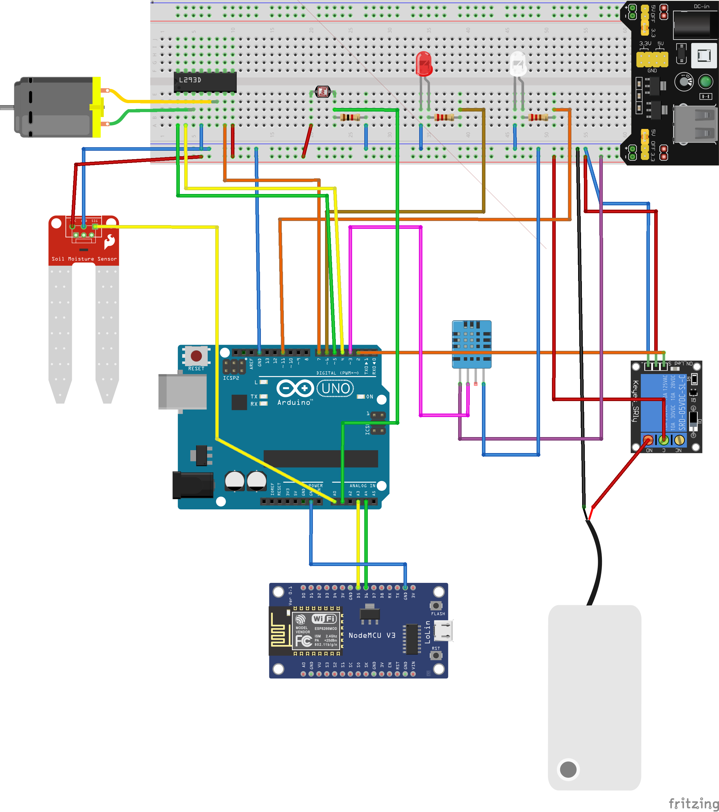

# GreenHouse Automation System

This repository contains the project for Arduino and ESP to use in the SmartGreenhouse application. 

## Hardware components
The hardware parts that you need are:

- Arduino UNO,
- Two Led, one red for the thermic lamp and one white for the normal lamp,
- Photo-resistor to record the brightness,
- Two 220 Ohm resistor for the led and one 1k Ohm for the photo-resistor 
- Soil Moisture sensor to record the humidity of the soil,
- DHT11 sensor to measure the air humidity and temperature,
- Fan blade, the related motor, L293D chip and the power supply module for the ventilation system,
- Water Pomp with a related 5V relay module for the irrigation,
- ESP NodeMCU for the communication.

Once that you have all sensors and actuators that you need, you can linking them following the reported scheme:

## Installation Guide

We suggest you to load the program with Arduino IDE, that you can download in this link: https://www.arduino.cc/en/software. 

### Libraries

To run the Arduino Project, you need to install the library for DHT11 Sensor. To do this, follow this step:

1. Download the zip file at this link:  https://github.com/olewolf/DHT_nonblocking/archive/refs/heads/master.zip,
2. In the Arduino IDE click on Sketch > #include library > Add library from zip,
3. Select the zip file previously downloaded.

To run the ESP Project, you need to install the ESP board:

1. Open the Preferences window
2. In Additional Board Manager URL add the URL of the json file that contains board info: 
http://arduino.esp8266.com/stable/package_esp8266com_index.json 
3. Open Boards Manager in Tools > Board item > Board Manager and install esp8266 platform 
4. After installation, choose the ESP8266 board from Tools > Board menu whenever you want to work with ESP
5. Once you have connected the board via USB, if you do not see the serial port (in Port) you need to install on your PC
NodeMCU 1.0 - CP210x chip USB to UART Bridge VCP -> driver:
https://www.silabs.com/developers/usb-to-uart-bridge-vcp-drivers
https://www.silabs.com/developers/usb-to-uart-bridge-vcp-drivers

6. NodeMCU 0.9 => CH340G chip => driver:
https://github.com/nodemcu/nodemcu-devkit/blob/master/Drivers/CH341SER_WINDOWS.zip 

Note for Linux systems:

- Ensure that the user has read/write rights to the USB port in question
`sudo chmod ugo+rw /dev/ttyUSB0`
- Include the user in the group that has access to the port
`sudo usermod -a -G dialout $USER`
- `log-out and log-in again`
- Remove and reconnect ESP

## Execution instruction

For the Arduino Project, you need to select from the Arduino IDE: Tools > Board > Arduino AVR Boards > Arduino Uno and always in Tools > Port select the port where the Arduino is connected.

For the ESP Project, you need to select from the Arduino IDE: Tools > Board > ESP8266 Boards > NodeMCU 1.0 (ESP-12E Module) and always in Tools > Port select the port where the ESP is connected.

At the end, click on the upload button on the IDE to load the program on the hardware.